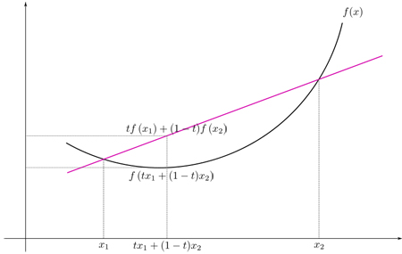
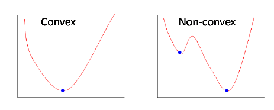
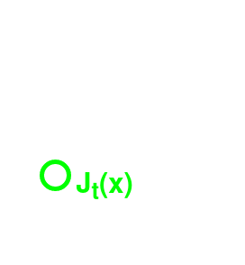

# Motion Planning and Control
## Week 2: Optimal Control
### Kyle Stachowicz

---

# Eercises
https://bit.ly/2W05oHU


Click "Open in Playground" to copy this notebook to your Google Drive.

https://github.com/kylestach/rj-controls-seminar

---

# Review
State-space form (state `$x$`, control `$u$`):
`$$\dot x = Ax + Bu$$`

---

# Review: pole placement
Let `$u = -Kx$`.
`$$\dot x = (A - BK)x$$`
Select eigenvalues of `$A - BK$`.

---

# Discrete time
 - So far, we've assumed time is _continuous_
 - This is true in physics, but not for a computer!

---

# Discrete time state-space
`$$x_{t+1} = f(x_t, u_t)$$`
`$$x_{t+1} = Ax_t + Bu_t$$`

---

# Discretization (approx.)
 - Pick a `$dt$`:
`$$A_d \approx I + A_cdt$$`
`$$B_d \approx Bdt$$`
 - Smaller `$dt$` is more accurate!

---

# Discretization (exact)
`$$A_d = e^{Adt}$$`
`$$B_d = A_c^{-1}(A_d - I)B$$`

---

# Discretization (code)
```python
from scipy.signal import cont2discrete
A_d, B_d, _, _, _ = cont2discrete((A_c, B_c, None, None), dt)
```

---

# Discrete pole placement
`$$v_{t+1} = \lambda v_t$$`
So we want `$0 < \norm*{\lambda} < 1$`. Complex values will still oscillate.

---

# Optimal Control
 - It's hard to specify how the controller should react with many inputs
 - Idea: create an _objective function_ describing how "good" a controller is, and find the best controller.
 - Problem: how can we do this?

---

# Optimization
 - We want to minimize a cost function $f$.
 - This is a _lot_ easier if it is _convex_:



---

# Optimization
 - If it's convex: just set the derivative to zero and solve! Example:
`$$\ell(x) = \frac 1 2 x^2 + x$$`
`$$\frac{\partial f}{\partial x} = x + 1 = 0 \implies x = -1$$`

---

# Optimization
 - If it's non-convex: it's only easy (maybe) to find _local_ minima:



---

# Quadratic Functions
`$$\begin{pmatrix} x_1 & x_2 \end{pmatrix} \begin{pmatrix} a & b \\ b & c \end{pmatrix} \begin{pmatrix} x_1 \\ x_2 \end{pmatrix} = ax_1^2 + 2bx_1x_2 + cx_2^2$$`

---

# Quadratic cost
`$$\ell(x, u) = \frac 1 2 x^TQx + \frac 1 2 u^TRu$$`
This is super easy to optimize!

---

# Exercise: Optimization

---

# Optimal Control
$$\min_u \sum_{t=1}^{T-1} \ell(x_t, u_t) + \Phi(x_T)$$
subject to
$$x_{t+1} = Ax_t + Bu_t$$

---

# Optimal Control
 - Fixed horizon
 - No direct control limits - large controls are only limited because it's expensive to use them

---

# Optimal Control
 - $\ell(x, u)$ (running cost, rate): how much it costs _per stage_ to be in a particular state and give a particular control input
 - $\Phi(x)$ (final/terminal cost, applied once): how much it costs to be in a particular state at the end of the horizon

---

# LQR Problem statement
$$\min_{u_t} \sum_{t=1}^{T-1}\frac 1 2\left[x_t^TQx_t + u_t^TRu_t\right] + \frac 1 2 x_T P x_T$$
$$x_{t+1} = Ax_t + Bu_t$$
How can we solve this?

---

# Cost-to-go
 - Define a new function `$J_t(x)$` as the optimal cost starting in `$x$` at time `$t$`.
`$$J_t(x) = \min_{u_t} \sum_{i=t}^{T-1}\ell(x, u) + \Phi(x_T)$$`

---

# Cost-to-go
## _Key Points_
 - $J_t$ is a _function_ $\mathbb{R}^n \to \mathbb{R}$ giving the cost-to-go for _any_ $x$.
    - How can we represent this?
 - $J_t$ is a different function for each $t$
 - $J_t$ is _accrued_ (summed), $\ell$ is instantaneous.

---

# Cost-to-go


---

# Cost-to-go
 - At the end, we only care about the final term:
`$$J_T(x) = \frac 1 2 x_T^T P x_T$$`
 - `$J_0(x_0)$` is the minimum cost for the whole trajectory.

**So how do we calculate `$J_0$`?**

---

# Bellman Equation
$$J_t = \min_{u_t}\left[\sum_{i=t}^{T-1}\ell(x_i, u_i) + \Phi(x_T)\right]$$
$$J_t = \min_{u_t}\left[\ell(x_t, u_t) + \sum_{i=t+1}^{T-1}\ell(x_i, u_i) + \Phi(x_T)\right]$$
$$J_t = \min_{u_t}\left[\ell(x_t, u_t) + J_{t+1}(f(x_t, u_t))\right]$$

---

# Dynamic Programming
Idea: use `$J_T$` to calculate `$J_{T-1}$`. Repeat.
`$$J_{T-1} = \min_{u_{T-1}}\left[\ell(x, u) + J_T(f(x, u))\right]$$`

---

# Deriving LQR

---

$$J_T(x) = \frac 1 2 x^T S x$$
$$J_t(x) = \frac 1 2 \min_{u_t}[x^T Q x + u^T R u + $$
$$\hspace{50pt}(Ax + Bu)^T S (Ax + Bu)]$$
$$J_t(x) = \frac 1 2 \min_{u_t}[x^T Q x + u^T R u + x^TA^TSAx + $$
$$\hspace{50pt}2x^TA^TSBu + u^TB^TSBu]$$

---

$$\frac{\partial}{\partial u}J_t(x) = \frac{\partial}{\partial u}\frac 1 2 \min_{u_t}[x^T Q x + u^T R u + $$
$$\hspace{48pt}x^TA^TSAx + 2x^TA^TSBu + $$
$$u^TB^TSBu] = 0$$
$$2u^TR + 2x^2A^TSB + 2u^TB^TSB = 0$$
$$u = -(R + B^TSB)^{-1}B^TSAx$$
$$K = (R + B^TSB)^{-1}B^TSA$$

---

$$K = (R + B^TSB)^{-1}B^TS_tA$$
$$S_t = A^T S_{t+1} A - (A^TS_{t+1}B)K + Q$$

---

# Tuning LQR
 - Use diagonal matrices
 - Only the _ratio_ between $Q, R, P$ matter.
 - Small $R$ = more aggressive.
 - Large $R$ = less aggressive.
 - Higher weight = you "care" a particular input/state more.

---

# Tuning LQR
## (Infinite-Horizon)
 - Pick the largest acceptable value for each control/state:
     - The entries of $Q$ should be $1 / x_{max}^2$
     - The entries of $R$ should be $1 / u_{max}^2$

_Tuning your model is super important!_

---

# Time-varying systems
Nothing we discussed prevents $A, B, Q, R$ from changing with time!
 - There's no physical reason to do this...yet
 - Stay tuned

---

# LQR for Control
 - Fixed horizon vs. infinite horizon
 - Calculate "steady-state" gain
 - This allows you to balance multiple inputs against each other

---

# Limitations
 - No control constraints
 - Fully linear system (no constant forces or skewed costs)
 - Fixed-horizon
